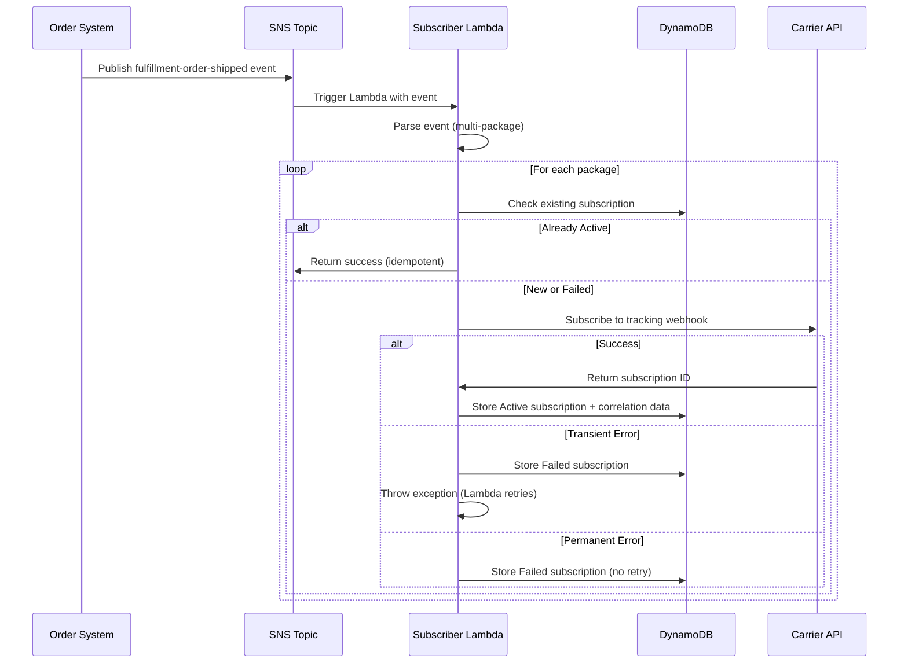
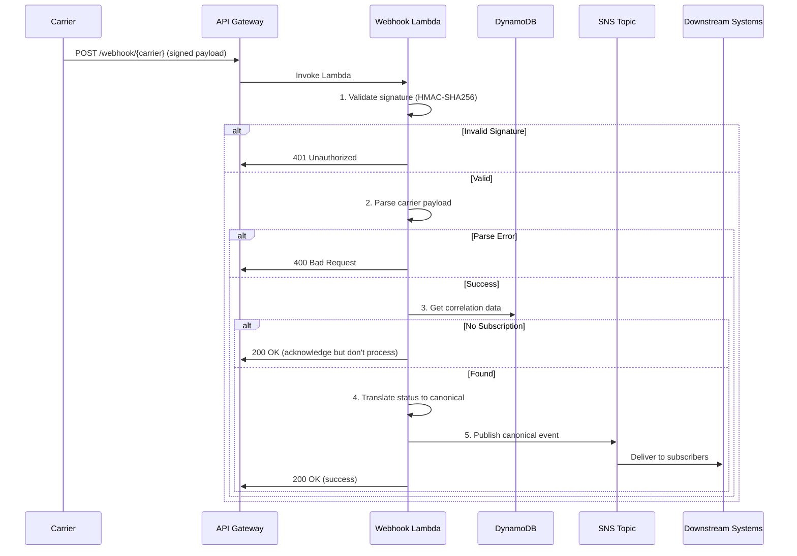

# Shipment Tracking Service - Architecture Documentation

## Overview

The Shipment Tracking Service is a cloud-native, event-driven system built on AWS Lambda (.NET 8) that provides real-time tracking updates for shipments across multiple carriers (USPS, UPS, FedEx). The system consists of two primary Lambda functions that work together to subscribe to carrier webhooks and process tracking status updates.

## System Architecture

```
┌─────────────────┐
│  Order System   │
│   (External)    │
└────────┬────────┘
         │ SNS: fulfillment-order-shipped
         ▼
┌──────────────────────────────────────────────────────────────┐
│              SUBSCRIBER LAMBDA                                │
│  ┌────────────────────────────────────────────────────────┐  │
│  │ 1. Receive SNS Event (fulfillment-order-shipped)       │  │
│  │ 2. Extract Package/Carrier Information                 │  │
│  │ 3. Check Idempotency (DynamoDB)                       │  │
│  │ 4. Subscribe to Carrier Webhook                       │  │
│  │ 5. Store Correlation Data (DynamoDB)                  │  │
│  └────────────────────────────────────────────────────────┘  │
└───────────────────────┬──────────────────────────────────────┘
                        │
                        ▼
              ┌──────────────────┐
              │   Carrier APIs   │
              │  (USPS/UPS/FedEx)│
              └─────────┬─────────┘
                        │ Webhook Callbacks
                        ▼
┌──────────────────────────────────────────────────────────────┐
│          WEBHOOK PROCESSOR LAMBDA (via API Gateway)          │
│  ┌────────────────────────────────────────────────────────┐  │
│  │ 1. Validate Webhook Signature (HMAC-SHA256)           │  │
│  │ 2. Parse Carrier-Specific Payload                     │  │
│  │ 3. Retrieve Correlation Data (DynamoDB)               │  │
│  │ 4. Translate to Canonical Status                      │  │
│  │ 5. Publish Canonical Event (SNS)                      │  │
│  └────────────────────────────────────────────────────────┘  │
└───────────────────────┬──────────────────────────────────────┘
                        │ SNS: shipment-tracking-status-event
                        ▼
             ┌────────────────────┐
             │  Downstream Systems │
             │  (Notifications,    │
             │   Analytics, etc.)  │
             └────────────────────┘
```

## Core Components

### 1. Subscriber Lambda

**Purpose**: Subscribe to carrier tracking webhooks when orders ship.

**Trigger**: SNS Topic (`fulfillment-order-shipped`)

**Key Responsibilities**:
- Process multi-package shipments
- Implement idempotent subscription logic
- Manage carrier API authentication
- Store correlation data for webhook processing
- Handle retry logic with exponential backoff

**AWS Resources**:
- Lambda Function (256-512 MB memory, .NET 8 runtime)
- DynamoDB Table (subscription records with TTL)
- SNS Subscription (input events)
- Secrets Manager (carrier API credentials)
- CloudWatch Logs & Metrics

### 2. Webhook Processor Lambda

**Purpose**: Receive and process carrier webhook callbacks.

**Trigger**: API Gateway (HTTP POST `/webhook/{carrier}`)

**Key Responsibilities**:
- Validate webhook authenticity (signature verification)
- Parse carrier-specific payloads
- Translate carrier statuses to canonical format
- Retrieve order correlation data
- Publish canonical events to SNS

**AWS Resources**:
- Lambda Function (512 MB-1024 MB memory, .NET 8 runtime)
- API Gateway REST API (custom domain, WAF protection)
- DynamoDB Table (read correlation data)
- SNS Topic (output events)
- Secrets Manager (webhook signing secrets)
- CloudWatch Logs & Metrics

### 3. Shared DynamoDB Table

**Purpose**: Store subscription records and correlation data.

**Schema**:
```
Table: ShipmentTrackingSubscriptions
Partition Key: PK (String) - Format: "TRACK#{Carrier}#{TrackingNumber}"
Sort Key: SK (String) - "META"

Attributes:
- Carrier (String)
- TrackingNumber (String)
- FulfillmentOrderId (String)
- OrderId (String)
- PackageId (String)
- SubscriptionStatus (String): Active, Pending, Failed, Expired
- CarrierSubscriptionId (String)
- CallbackUrl (String)
- AttemptCount (Number)
- LastError (String)
- ErrorType (String)
- CreatedAt (String - ISO 8601)
- UpdatedAt (String - ISO 8601)
- ActivatedAt (String - ISO 8601)
- TTL (Number - Unix epoch)
- Metadata (Map)
```

**Access Patterns**:
1. Get subscription by carrier + tracking number (Query)
2. Conditional write for idempotency (PutItem with ConditionExpression)
3. Update subscription status (UpdateItem)
4. TTL-based automatic cleanup (90 days default)

## Data Flow

### Subscription Flow



### Webhook Processing Flow



## Design Patterns

### 1. Factory Pattern
- **CarrierSubscriptionClientFactory**: Creates appropriate carrier client based on carrier code
- Enables easy addition of new carriers
- Centralizes carrier routing logic

### 2. Strategy Pattern
- **ICarrierSubscriptionClient**: Different implementations for USPS, UPS, FedEx
- **ICarrierPayloadParser**: Carrier-specific parsing strategies
- **IWebhookValidator**: Carrier-specific validation strategies

### 3. Repository Pattern
- **SubscriptionRepository**: Abstracts DynamoDB operations
- Enables testing with mock repositories
- Centralizes data access logic

### 4. Circuit Breaker Pattern (Polly)
- Protects against cascading failures in carrier API calls
- Configurable failure thresholds and recovery periods
- Exponential backoff with jitter for retries

## Security Architecture

### 1. Webhook Signature Validation

**Algorithm**: HMAC-SHA256

**Process**:
1. Extract signature and timestamp from headers
2. Validate timestamp freshness (±5 minutes default)
3. Compute expected signature: `HMAC-SHA256(timestamp + "." + payload, secret)`
4. Constant-time comparison to prevent timing attacks

**Implementation**:
```csharp
// Pseudo-code for signature validation
signature = request.Headers["X-Carrier-Signature"]
timestamp = request.Headers["X-Carrier-Timestamp"]
secret = GetSecretFromSecretsManager("carrier/{carrier}/webhook-secret")

message = $"{timestamp}.{payload}"
expectedSignature = HMACSHA256(message, secret)

if (!ConstantTimeEquals(signature, expectedSignature))
    return 401 Unauthorized
```

### 2. IAM Least Privilege

**Subscriber Lambda IAM Policy**:
```json
{
  "Version": "2012-10-17",
  "Statement": [
    {
      "Effect": "Allow",
      "Action": [
        "dynamodb:GetItem",
        "dynamodb:PutItem",
        "dynamodb:UpdateItem"
      ],
      "Resource": "arn:aws:dynamodb:*:*:table/ShipmentTrackingSubscriptions"
    },
    {
      "Effect": "Allow",
      "Action": ["secretsmanager:GetSecretValue"],
      "Resource": "arn:aws:secretsmanager:*:*:secret:carrier/*"
    },
    {
      "Effect": "Allow",
      "Action": ["logs:CreateLogGroup", "logs:CreateLogStream", "logs:PutLogEvents"],
      "Resource": "*"
    }
  ]
}
```

**Webhook Processor Lambda IAM Policy**:
```json
{
  "Version": "2012-10-17",
  "Statement": [
    {
      "Effect": "Allow",
      "Action": ["dynamodb:GetItem"],
      "Resource": "arn:aws:dynamodb:*:*:table/ShipmentTrackingSubscriptions"
    },
    {
      "Effect": "Allow",
      "Action": ["sns:Publish"],
      "Resource": "arn:aws:sns:*:*:shipment-tracking-status-events"
    },
    {
      "Effect": "Allow",
      "Action": ["secretsmanager:GetSecretValue"],
      "Resource": "arn:aws:secretsmanager:*:*:secret:carrier/*/webhook-secret"
    },
    {
      "Effect": "Allow",
      "Action": ["logs:CreateLogGroup", "logs:CreateLogStream", "logs:PutLogEvents"],
      "Resource": "*"
    }
  ]
}
```

### 3. Secrets Management

All sensitive credentials stored in AWS Secrets Manager:
- `carrier/usps/credentials`: API key, client ID, client secret
- `carrier/usps/webhook-secret`: HMAC signing secret
- `carrier/ups/credentials`: UPS API credentials (future)
- `carrier/fedex/credentials`: FedEx API credentials (future)

**Caching Strategy**: 5-minute in-memory cache to reduce Secrets Manager API calls.

## Observability

### 1. Structured Logging

All logs include:
- Correlation ID (links events across services)
- Carrier and tracking number (masked for privacy)
- Operation name and duration
- Error details with classification

**Example Log Entry**:
```json
{
  "timestamp": "2026-01-09T12:00:00.000Z",
  "level": "Information",
  "message": "Successfully processed package subscription",
  "CorrelationId": "FO-12345_PKG-001",
  "Carrier": "USPS",
  "TrackingNumber": "9400****0000",
  "SubscriptionId": "sub_abc123",
  "DurationMs": 245
}
```

### 2. Custom Metrics (CloudWatch EMF)

**Subscriber Lambda**:
- `SubscriptionAttempts` (by carrier, status)
- `SubscriptionDuration` (milliseconds)
- `CarrierAPIErrors` (by carrier, error type)
- `IdempotentSkips` (count)

**Webhook Processor Lambda**:
- `WebhooksReceived` (by carrier)
- `WebhooksProcessed` (by carrier, status)
- `ValidationFailures` (by carrier, reason)
- `StatusTranslations` (by carrier, canonical status)
- `ProcessingDuration` (milliseconds)

### 3. Distributed Tracing

- W3C TraceContext propagation
- AWS X-Ray integration
- Correlation IDs in all logs and metrics
- Service map visualization

## Error Handling & Retry Strategy

### Subscriber Lambda

**Error Classification**:
- **Transient**: Network timeouts, 5xx errors → Lambda automatic retry
- **Rate Limit**: 429 responses → Exponential backoff, max 3 attempts
- **Permanent**: 4xx errors (except 429), invalid tracking → No retry, mark as failed

**Retry Configuration**:
- Max attempts: 3 (configurable in DynamoDB)
- Backoff: Decorrelated jitter (1s median, max 60s)
- DLQ: Messages after max retries

### Webhook Processor Lambda

**Error Handling**:
- Invalid signature → 401 Unauthorized (no retry)
- Parse error → 400 Bad Request (no retry)
- No subscription found → 200 OK (acknowledge but don't process)
- SNS publish failure → Log error, return 500 (carrier will retry)

## Performance Characteristics

### Subscriber Lambda

- **Cold Start**: ~800ms-1.5s
- **Warm Execution**: 100-300ms per package
- **Throughput**: 10-50 packages/second (concurrent executions)
- **Memory**: 256-512 MB recommended

### Webhook Processor Lambda

- **Cold Start**: ~800ms-1.5s
- **Warm Execution**: 50-150ms
- **Throughput**: 100-500 webhooks/second (concurrent executions)
- **Memory**: 512-1024 MB recommended

## Scalability

Both Lambdas scale automatically:
- **Concurrent Executions**: 1000 (default), increase via service quotas
- **DynamoDB**: On-demand capacity mode (automatic scaling)
- **SNS**: Unlimited throughput
- **API Gateway**: 10,000 requests/second (soft limit, increasable)

## Cost Optimization

1. **Lambda**: Pay per request + duration (GB-seconds)
2. **DynamoDB**: On-demand pricing, TTL for automatic cleanup
3. **API Gateway**: Pay per million requests
4. **SNS**: Pay per million requests
5. **Secrets Manager**: Cached retrieval reduces API calls

**Estimated Monthly Cost** (for 1M shipments, 5M tracking events):
- Lambda: ~$50-100
- DynamoDB: ~$25-50
- API Gateway: ~$3.50
- SNS: ~$5
- Secrets Manager: ~$2
- **Total**: ~$85-160/month

## Disaster Recovery

### Backup Strategy

- **DynamoDB**: Point-in-time recovery enabled (35-day retention)
- **Secrets**: Stored in Secrets Manager with automatic rotation
- **Code**: Git repository with CI/CD pipeline

### Recovery Procedures

1. **Lambda Failure**: Automatic retry via SNS/SQS, DLQ for permanent failures
2. **DynamoDB Outage**: Use point-in-time recovery
3. **Carrier API Outage**: Circuit breaker prevents cascading failures
4. **Data Loss**: Restore from DynamoDB backup

## Future Enhancements

1. **Additional Carriers**: UPS, FedEx implementations
2. **Batch Processing**: Process multiple webhooks in single invocation
3. **Advanced Analytics**: Real-time dashboards, anomaly detection
4. **Machine Learning**: Predictive delivery ETAs
5. **Multi-Region**: Active-active deployment for higher availability

## Related Documentation

- [Subscriber Lambda Documentation](./subscriber-lambda/README.md)
- [Webhook Processor Lambda Documentation](./webhook-processor-lambda/README.md)
- [Deployment Guide](./deployment/README.md)
- [Infrastructure as Code](../infrastructure/README.md)
